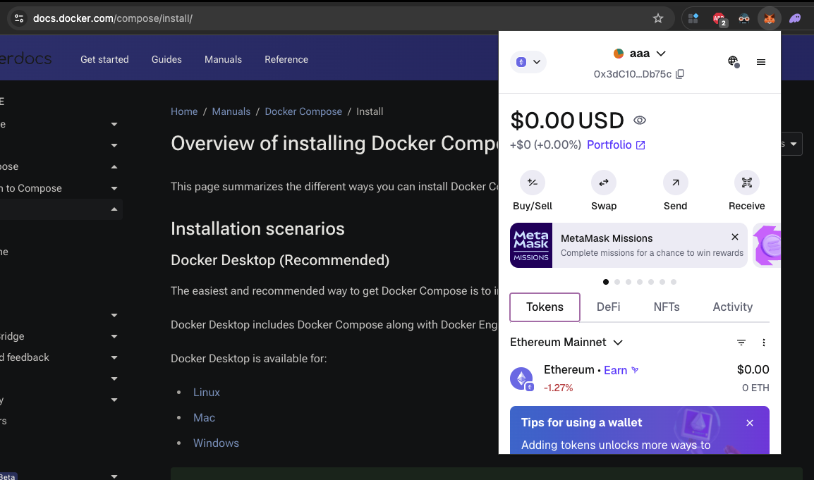
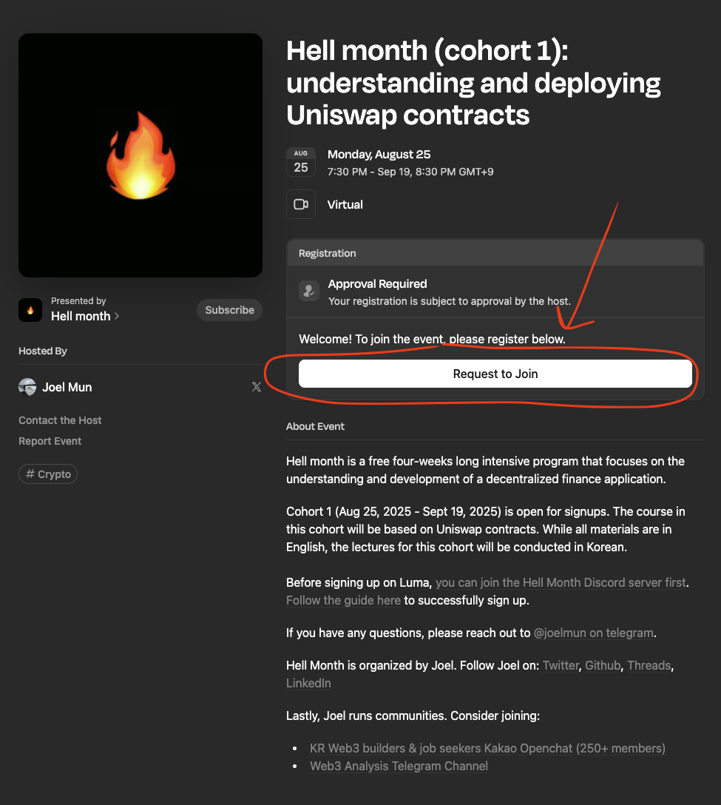
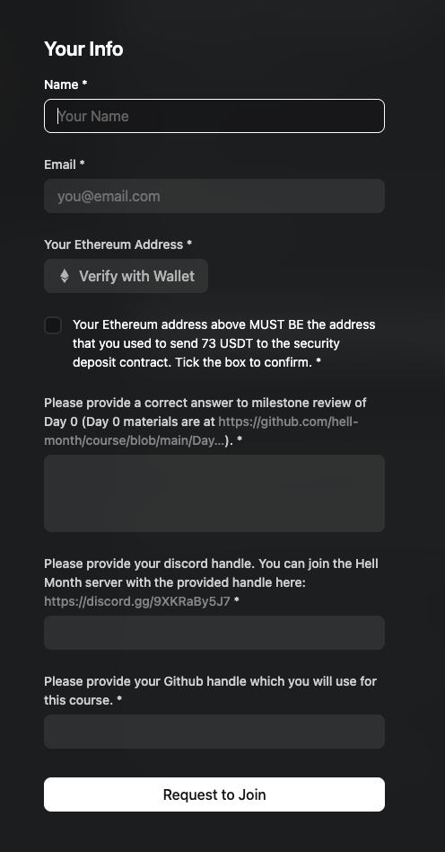

# Day 0

Welcome to Day 0 of the Hell Month course!

Throughout this course, you will learn the basics of DApp development as well as decentralized finance based on [Uniswap V2 contracts](https://github.com/hell-month/v2-core).

## Core values

Here're the most important values we want to instill in you:

1. **English-first**: We will use English as the primary language for all course materials and discussions, no matter who you are. The reason is simple: English is the lingua franca of the blockchain world, and we want you to be trained to understand technical concepts in English, even if it might not be your first language.
1. **Open-source**: All course materials will be open-sourced, and we encourage you to contribute back. This is not just about learning; it's about building a community of developers who can help each other grow.
1. **Hands-on**: We believe in **learning by doing**. No more passive listening. Each day will include practical milestones to reinforce your understanding of the concepts covered.
1. **AI-assisted**: You can always search on Google or ChatGPT. In most cases, they will give you the right answer to each step you need to take. This leads to our next point, which is **Goal-oriented**.
1. **Goal-oriented**: **_The primary problem when it comes to learning is that you don't even know what you don't know_**. But we won't provide you with step-by-step instructions or straightforward solutions. Instead, **we will give you the goal and let you figure out the details.** This is to help you develop problem-solving skills and become a more independent developer. Achieving any goals should be a no-brainer if you can Google it, right? So, we will provide you with the goals, and you can use Google or AI any other resources like Youtube to find the solutions.
1. **Trying harder till success**: No one succeeds on the first try. But there always is a way to succeed if you try harder. If you keep failing, just try harder.
   You shouldn't give up so easily, because this is what engineering looks like in practice.

## Prerequisites

Since this course is designed for anyone regardless of their background, we want to make sure you have the necessary prerequisites to get started.

You can skip this section if you already know what's going on, as these are just the basics.

> [!IMPORTANT]
> Before anything, you can join [Hell Month Discord server](https://discord.gg/9XKRaBy5J7) to get help from the community and ask questions in the waiting room, even before completing Day 0.

### Goal #1

> [!CAUTION]
> Again, if you are not familiar with any of the terms below, you MUST use Google or AI to help you understand them. This is a crucial step to ensure you can follow along with the course. **We will NOT explain everything to you.**

1. Create a KYC'ed account at any CEX, and put some money into your account. It could be [Binance](https://binance.com), [Coinbase](https://coinbase.com/), [Upbit](https://upbit.com/), [Bithumb](https://www.bithumb.com/react/), or any other centralized exchange. Once you are successful, you will be able to buy some crypto assets like Bitcoin or Ether there.
1. Install a non-custodial wallet as an extension on Chrome. You can use [MetaMask](https://metamask.io/), [Rainbow](https://rainbow.me/), or any other wallet that supports Ethereum and ERC-20 tokens. Create a new seed phrase for an Ethereum account, and make sure to back up your seed phrase securely. And make sure that your computer is secure and free from malware. Once you have installed your wallet, it should be something like this:

   

1. First, check the minimum withdrawal amount for ETH on the CEX you signed up for. Purchase a little bit of ETH that is greater than the minimum withdrawal amount (e.g., 30 USD worth of ETH), and transfer it to your non-custodial wallet **via Ethereum network** created in step 2. This will be your first interaction with a blockchain.
1. Locate the transaction hash of the transfer you made from your CEX account to your non-custodial wallet in step 3 and **save it for the milestone review**.

> [!NOTE]
> Alternatively, if you already have a prefunded non-custodial wallet, you can skip steps 1-3 and just provide the transaction hash of the last deposit of ETH you made to your non-custodial wallet.

### Goal #2

> [!CAUTION]
> Again, if you are not familiar with any of the terms below, you MUST use Google or AI to help you understand them. This is a crucial step to ensure you can follow along with the course. **We will NOT explain everything to you.**

1. This course is primarily designed for students on Linux or MacOS. If you are using Windows, you must install [WSL 2](https://docs.microsoft.com/en-us/windows/wsl/install) and use Ubuntu as your Linux distribution. This will allow you to run Linux commands and tools on your Windows machine.
1. Once you're able to access Linux or MacOS, open your terminal and run the following command:

   ```bash
   uname -a
   date
   ```

   This will display your system information and the current date. Make sure you can run these commands without any issues. **Save the output of these commands for the milestone review**. It should look something like this:

   ```bash
   Darwin abc-MacBook-Pro.local 22.6.0 Darwin Kernel Version 22.6.0: Tue Nov  7 21:42:24 PST 2023; root:xnu-8796.141.3.702.9~2/RELEASE_ARM64_T6020 arm64
   Wed Aug  6 20:39:15 KST 2025
   ```

1. Install these tools on your system (**if you are using Windows, make sure you install these on WSL2, not your Windows system**). You can follow the respective installation guides for each tool:

   - [nvm](https://github.com/nvm-sh/nvm)
   - [git](https://github.com/git-guides/install-git)
   - [docker desktop](https://docs.docker.com/get-docker/)

   After installing these tools, make sure they are accessible in your terminal by running:

   ```bash
   node -v
   nvm --version
   git --version
   docker --version
   docker compose version
   ```

   **Save the output of these commands for the milestone review**.

### Goal #3

1. If you are new to Solidity, complete the [Solidity tutorial on CryptoZombies](https://cryptozombies.io/en/solidity).
1. If you are new to Git or just using terminal, complete [GitExercises](https://gitexercises.fracz.com/). It's not mandatory to complete all [23 exercises](https://gitexercises.fracz.com/exercise/master), but completing some of them will help you get familiar with Git and some other commands on the terminal.
1. If you are so lost trying to work on the previous goal on Git, start from [GitImmersion](https://gitimmersion.com/lab_01.html).

> [!NOTE]
> If you are already familiar with Solidity, Git and terminal, you can skip this goal. While no milestone review is required for this goal, it's likely that you won't be able to adjust to the course without completing this tutorial if you are totally new to these concepts. Take this opportunity to familiarize yourself with the tools and concepts before the course starts.

### Goal #4

1. Create a new account on [Github](https://github.com) if you don't have it yet.
1. Create a new account on [Discord](https://discord.com/) if you don't have it yet and install the desktop app.
1. Install [Visual Studio Code](https://code.visualstudio.com/) or [Cursor](https://cursor.com/).

### Goal #5

> [!NOTE]
> The deposit is fully refundable by the end of the course as long as all milestones are achieved. In case you fail to achieve some milestones, a part of your deposit may be used to cover the operational costs of maintaining the community (e.g., hosting a side event at KBW 2025, etc.).

1. Purchase 73 USDT from your CEX account and transfer it to your non-custodial wallet on Ethereum network. This will be used as a deposit for the course.
1. Make sure your non-custodial wallet has enough Ether to cover the gas fees for the deposit and withdraw transaction later. Typically speaking, less than 10 USD worth of Ether would be enough.
1. At this point, your non-custodial wallet should have 73 USDT and some Ether. You can check your wallet balance on [Etherscan](https://etherscan.io/) by entering your wallet address in the search bar.
1. Navigate to the [security deposit DApp of Hell Month](https://deposit.hellmonth.org/).
1. Connect your wallet, approve the security deposit contract to spend your USDT, and deposit 73 USDT to the contract. This will be your security deposit for the course.
1. Confirm that you have successfully deposited 73 USDT by checking the transaction on Etherscan. You should see a transaction with the `Deposit` event emitted from the contract. **Save the transaction hash of the deposit for the milestone review**.

> [!NOTE]
> Alternatively, if you already somehow had 73 USDT in your non-custodial wallet, you can skip steps 1-3 and just provide the transaction hash of the last deposit of USDT you made to your non-custodial wallet.

## Milestone Review

> [!IMPORTANT]
> If you still haven't joined [Hell Month Discord server](https://discord.gg/9XKRaBy5J7), please do so now, as the course will be conducted primarily on Discord.

Navigate to the [Luma Signup page](https://lu.ma/y8eoof0m) and click on the "Request to join" button:



**Then, fill out the form**:



Make sure you sign up for [the course on Luma](https://lu.ma/y8eoof0m) with the same wallet address you used for the deposit. This is crucial for us to verify your participation.

Then, submit the following information altogether as an answer to the question "Please provide a correct answer to milestone review of Day 0." on [Luma Signup page](https://lu.ma/y8eoof0m):

1. The transaction hash from Goal #1.
1. The output of the `uname -a` and `date` commands from Goal #2.
1. The output of the version commands for Node.js, NVM, Git, Docker, and Docker Compose from Goal #2.
1. The transaction hash of the deposit transaction from Goal #5.

Lastly, provide your GitHub username and Discord username in the form.

You will get an email notification from Luma once your request to join is approved. If you don't receive it within 24 hours, please reach out to us on Discord.
