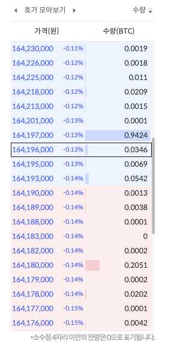
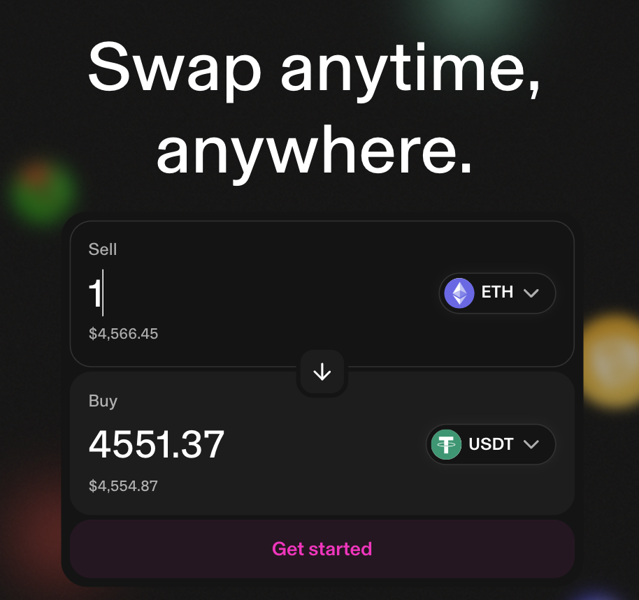

# Day 1

---

# Problem



Orderbooks are boring & inefficient

Any ways to trade other than orderbooks?

---

# Intuition

Consider BTC/KRW pair

Simplify actions into:

1. buy
2. sell

When

1. buy: price ⬆
2. sell: price ⬇️

Can we make this just happen without an orderbook?

---

# [Uniswap](https://app.uniswap.org): yes



---

# [Brief history of Uniswap](https://blog.uniswap.org/uniswap-history)

1. V1: Proof of concept
2. **V2: Constant Product (x \* y = k) Automated Market Maker**
3. V3: Concentrated liquidity & Capital efficiency
4. V4: V3 + hooks

---

# Constant Product Automated Market Maker (CPAMM)

$x \times y = k$

where

$x$ is the amount of token A
$y$ is the amount of token B
$k$ is the product of $x$ and $y$

---

# CPAMM Example

$x = \text{Amount of USDC}$
$y = \text{Amount of BTC}$

Let $x = 1000$ and $y = 1$. Then $k = 1 \times 1000$

Alice wants to pay 1000 USDC to get BTC. How much BTC can she get?

---

<!-- <style scoped>
section {
  font-size: 20px;
}
</style> -->

# CPAMM Example (cont.)

1 BTC? No...

$(x + Δx) * (y — Δy) = k$

We want to keep $k$ _constant_ as 1000
$Δ\text{asset}$ is the difference in the amount of the asset in the market.
We use this equation to derive $Δy$ first.

We know that $Δx = 1000$ because Alice is paying 1000 USDC.

---

# CPAMM Example (cont.)

$(1000 + 1000) * (1 — Δy) = 1000$
$2000 * (1 — Δy) = 1000$
$2 * (1 — Δy) = 1$
$1 — Δy = \frac{1}{2}$
$—Δy =\frac{1}{2} - 1$
$\therefore  Δy=\frac{1}{2}$ BTC

Alice will get 0.5 BTC in return for 1000 USDC payment
Effective price = $\frac{1000 \text{ USDC}}{0.5 \text{ BTC}} = 2000 \text{ USDC}$

New market: $x' = 2000, y' = 0.5$

---

# AI Guiding questions

Ask ChatGPT these questions yourself to kickstart your own study (feel free to tweak these questions and ask follow-up questions):

> What's the difference between trading on orderbook and constant product automated market maker?

> Let's talk about constant product automated market maker based on x \* y = k. Say the market initializes with 1 BTC and 1000 USDC. Then tell me the k, and give me an example of how would a trade affect the price of BTC relative to USDC.

> On Uniswap v2, does k actually stay constant all the time? Or are there conditions on which it changes? Why?

---

# Assignment 1A: write and deploy your first x \* y = k contract

1. Use the EVM non-custodial wallet that you used for the Hell Month security pool deposit for the next steps.
1. We'll use [Flare Testnet](https://testnet.flarescan.com/) to deploy contracts due to the ease of getting testnet tokens. Go to [the faucet](https://faucet.flare.network/coston2) and input your EVM wallet address to get C2FLR testnet token.
1. Fork [`https://github.com/hell-month/cohort-1-assignments-public`](https://github.com/hell-month/cohort-1-assignments-public) and `git clone` the forked repository to your own computer, and start working on `1a` folder.
1. Further instructions are on README.md and the code

---

# Assignment 1B (optional): bootstrap your first local development environment

Here's the detailed requirement of your local development environment.

- Run all containers on docker-compose
- Access Blockscout on localhost
- Access Geth on localhost
- Access deployed smart contracts from Assignment 1
- And more..
- Materials are at `1b` folder of https://github.com/hell-month/cohort-1-assignments-public.

---

# Assignment 1A Submission

- Submit your deployed contract address at https://docs.google.com/spreadsheets/d/1LtR6zEHqmUgXdRn0NSkm2pmDreL8w3GBOMDGs7vVUGE/edit?usp=sharing. RPC calls will be made to see if the contract works as intended.
- Make sure your forked https://github.com/hell-month/cohort-1-assignments to your account and updated the code for assignment 1A. `forge test` will be run to verify if the contract works. Project setup may also be checked.
- Deadline: 23:59 KST, Sept 1, 2025

---

# Recommended reading list

- [Uniswap V1 Whitepaper](https://raw.githubusercontent.com/hell-month/static/master/uniswap%20v1%20whitepaper%20hackmd.pdf)
- [Uniswap V2 Core whitepaper](https://app.uniswap.org/whitepaper.pdf) (you can choose to read only these parts below)
  ```
  1. Introduction
  2.1 ERC-20 pairs
  3. Other changes
  ```
- Page 1-3 of [Formal Specification of Constant Product (x × y = k) Market Maker Model and Implementation](https://raw.githubusercontent.com/runtimeverification/verified-smart-contracts/master/uniswap/x-y-k.pdf)
- [On Path Independence](https://vitalik.eth.limo/general/2017/06/22/marketmakers.html) by Vitalik
- [Let's run on-chain decentralized exchanges the way we run prediction markets](https://www.reddit.com/r/ethereum/comments/55m04x/lets_run_onchain_decentralized_exchanges_the_way/) by Vitalik
- [Improving front running resistance of x\*y=k market makers](https://ethresear.ch/t/improving-front-running-resistance-of-x-y-k-market-makers/1281) by [Vitalik](https://ethresear.ch/u/vbuterin)
