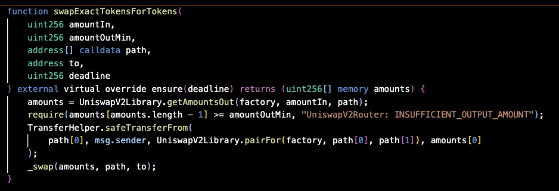

# Day 5

Uniswap V2 core and router contracts

---

# Reference repositories

- https://github.com/hell-month/uniswap-v2-core-latest: fork of https://github.com/Uniswap/v2-core
- https://github.com/hell-month/uniswap-v2-router-latest: fork of https://github.com/Uniswap/v2-periphery

---

# `MiniAMM` contract

Synonymous to [Uniswap V2 Pair contract](https://github.com/hell-month/uniswap-v2-core-latest/blob/main/src/UniswapV2Pair.sol):
  - Add/remove liquidity
  - Swap based on the CPAMM Formula $x \times y = k$
  - Mint/burn LP Token
  - Protocol & swap fees

---

# More features in Uniswap V2 Pair contract

- [Time-weighted average price (TWAP) oracle](https://docs.uniswap.org/contracts/v2/concepts/core-concepts/oracles)
- [Flash swaps](https://docs.uniswap.org/contracts/v2/concepts/core-concepts/flash-swaps)

---

# TWAP oracle

Example:
- Block 1: ETH = $2000
- Block 2: ETH = $2100
- Block 3: ETH = $1900

TWAP over 3 blocks = $2000

In other words, to get TWAP:
1. Check cumulative price now
2. Check cumulative price some time before
3. Divide the difference by time elapsed

---

# Why TWAP?

Hard to fake.

Spot prices (current prices) in AMMs can be manipulated easily. Someone with a flash loan could:
1. Borrow $10M
2. Buy ETH, pushing price from $2000 to $5000
3. Trigger liquidations/oracles at the fake $5000 price
4. Sell ETH back, returning price to $2000
5. Repay loan

---

# Flash swaps

The Setup:
- Uniswap price: 1 ETH costs 200 DAI
- Oasis price: 1 ETH sells for 220 DAI
- Profit opportunity: 20 DAI difference

The Process:
1. Flash borrow 1 ETH from Uniswap (no collateral needed)
2. Sell that 1 ETH on Oasis → receive 220 DAI
3. Pay back Uniswap → send 200 DAI (what 1 ETH costs on Uniswap)
4. Keep the profit → 20 DAI remains in your pocket

---

# `MiniAMMFactory` contract

Synonymous to [Uniswap V2 Factory contract](https://github.com/hell-month/uniswap-v2-core-latest/blob/main/src/UniswapV2Factory.sol):
  - Manage fees
  - Deploy and manage pairs

---

# Router contract

[Periphery contract](https://github.com/Uniswap/v2-periphery) = router contract (99%).

---
# Router contract (cont.)

---

# Router contract (cont.)

---

# Router contract (cont.)

Many helper functions to swap comfortably.

- amountIn: The exact amount of input tokens to swap
- amountOutMin: The minimum amount of output tokens that must be received for the transaction to not revert (slippage protection)
- path: An array of token addresses representing the swap route (e.g., [tokenA, tokenB, tokenC] swaps A→B→C)
- to: The recipient address that will receive the output tokens
- deadline: Unix timestamp after which the transaction will revert (prevents stale transactions)

---

# Assignment 3 (not checked)

Read to understand:
- [Uniswap V2 Pair contract](https://github.com/hell-month/uniswap-v2-core-latest/blob/main/src/UniswapV2Pair.sol)
- [Uniswap V2 Factory contract](https://github.com/hell-month/uniswap-v2-core-latest/blob/main/src/UniswapV2Factory.sol)
- [Uniswap V2 Router contract](https://github.com/hell-month/uniswap-v2-router-latest/blob/main/src/UniswapV2Router02.sol)

Use unit tests under `test/` folder to understand how the contracts work.
