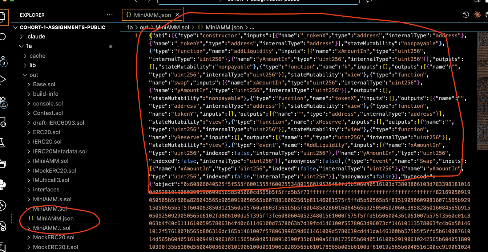
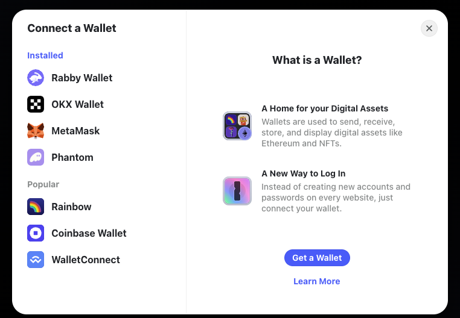

# Day 6

Vibecoding the DApp frontend

---

# Stack

- AI (Claude, gpt-5, etc)
- [React](https://react.dev/) + [Typescript](https://www.typescriptlang.org/) + [Next.js](https://nextjs.org/): frontend stack
- [Ethers.js@6](https://docs.ethers.org/v5/): blockchain interaction
- [RainbowKit](https://rainbowkit.com/): wallet connection
- [TypeChain](https://github.com/dethcrypto/TypeChain): type-safe contract interaction
- [Cloudflare Workers](https://developers.cloudflare.com/workers/framework-guides/web-apps/nextjs/): hosting

---

# React + Typescript + Next.js

- npm: synonymous to `forge` for Solidity. Node package manager/automation tool for JavaScript/TypeScript
- React: UI library
- Typescript: language that adds types to JavaScript
- Next.js: React framework for building web applications

---

# ABI (Application Binary Interface)

Problem:
- How does the frontend know what functions a smart contract has?

Solution:
- ABI: JSON file that describes the functions and events of a smart contract

---

# ABI (cont.)

You can see yourself by running `forge build` and looking in `out` folder.



---

# ABI (cont.)

```solidity
{
  "type": "function",
  "name": "swap",
  "inputs": [
    { "name": "xAmountIn", "type": "uint256", "internalType": "uint256" },
    { "name": "yAmountIn", "type": "uint256", "internalType": "uint256" }
  ],
  "outputs": [],
  "stateMutability": "nonpayable"
},
```

---

# Typechain

Problem:
Ethers.js sucks at type safety

Solution:
Typechain generates TypeScript types from ABI files

Why is type safety important?:
- Catch errors at compile time
- Better developer experience (autocomplete, etc)

---

# RainbowKit

https://deposit.hellmonth.org


---

# RainbowKit (cont.)

https://deposit.hellmonth.org



---

# Cloudflare Workers

https://deposit.hellmonth.org is actually hosted on https://security-deposit-fe.pages.dev

Similar free alternatives:
Vercel, Netlify, Surge.sh, Github pages

You can use whichever one that works for you

[Read the docs here](https://developers.cloudflare.com/workers/framework-guides/web-apps/nextjs/)

```
npm create cloudflare@latest -- 3 --framework=next
```

---

# Asking AI to generate code for you

- If you want to stay on a free plan, just use Cursor or Windsurf free plan
- **Make the specs and requirements clear and specific**

---

## Smart contract requirements

- Deploy the contract from A2 **again**
- This time, deploy a new `MiniAMM` contract from `MiniAMMFactory` by calling `createPair` function in `Factory.s.sol` script and remember the address of the deployed `MiniAMM` contract as well as the two `MockERC20` tokens
- Use Flare Coston 2 testnet

---
<style scoped>
section {
  font-size: 18px;
}
</style>

# FE Requirements

## Features
- Connect/disconnect wallet
- Mint `MockERC20` tokens
- Approve `MiniAMM` to spend `MockERC20` tokens by calling `approve` function on the two `MockERC20` contracts involved
- Swap tokens on `MiniAMM` by calling `swap` function
- Remove/add liquidity on `MiniAMM` by calling `removeLiquidity` and `addLiquidity` functions

## Displays
- Show current amount of `MockERC20` tokens in the connected wallet and `miniAMM` contract
- Show a swap interface:
  - choose which of the two tokens to sell
  - input the amount to sell
  - show the amount of the other token that will be received (calculate using the constant product formula)
  - a button to execute the swap
  - after the swap, temporarily disable a button, show a loading indicator until the transaction is confirmed, and then update all relevant numbers as needed and enable the button again

---

# FE example

https://3.joelmun.workers.dev

Try to mimic the functionality as much as possible (design doesn't have to be exactly the same)

---

# Assignment 4B

4A doesn't need to be submitted, but it will be submitted together with 4B.
4B just adds a subgraph deployment and connects the frontend to the subgraph.
**4B is the final assignment of Hell Month.**

[Submit the subgraph URL, frontend URL, and contract addresses on Google Sheets](https://docs.google.com/spreadsheets/d/1LtR6zEHqmUgXdRn0NSkm2pmDreL8w3GBOMDGs7vVUGE/edit?gid=62343204#gid=62343204).
**Deadline: 23:59 Sept 30 (Tues) KST**

쓰레기 관리/배출 방법