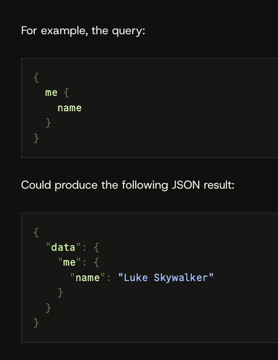

# Day 7

Collecting data from the blockchain

---

# Problem

How can we efficiently store & query historical data from the blockchain?

# Possible solutions

1. Store data off-chain in a traditional database (e.g. PostgreSQL, MongoDB) with a backend server (e.g. Node.js, Python Flask)
1. Query directly from the blockchain using a library (e.g. ethers.js, web3.js)

---

# Another solution: the Graph

https://thegraph.com/

Open source blockchain for indexing and querying data from blockchains.

---

# GraphQL

[Simple query language for APIs](https://graphql.org/). What if it could be used to query blockchain data?



---

# Try it our yourself

https://api.goldsky.com/api/public/project_cl6mb8i9h0003e201j6li0diw/subgraphs/orderbook-subgraph/0.0.1/gn

```graphql
query MyQuery {
  orderFilledEvents(first:5) {
    transactionHash,
    id,
    timestamp,
    maker,
    taker,
  }
}
```
Go to PolygonScan to check the tx hash.

---

# Open source forks

- https://goldsky.com/
- https://subquery.network/
- https://subsquid.io

## Alternatives

- https://www.shadow.xyz/
- https://ponder.sh/

---

# Goldsky

- Free tier
- Supports Flare Coston 2 Testnet
- Easy to use (more abstraction)
- Instructions: https://docs.goldsky.com/subgraphs/deploying-subgraphs#install-goldskys-cli-and-log-in

---

# Try it

- MiniAMM: [0xA89b682b4773077AF55281fb4978E3BEa8c32B33](https://coston2-explorer.flare.network/address/0xA89b682b4773077AF55281fb4978E3BEa8c32B33?tab=txs)
- Supply your ABI (file name should be all lowercase): miniamm.json
- Flare Coston 2 Testnet (flare-coston2)
- Start block: block number when you deployed the contract

---

# Open source Subgraph examples

- https://github.com/Uniswap/v2-subgraph
- https://github.com/aave/protocol-subgraphs
- https://github.com/georgeroman/erc20-subgraph/blob/532f51108be11a00fcfb5c96a249de075b5330d1/src/mapping.ts#L90

---

# How to create a subgraph
<style scoped>
section {
  font-size: 16px;
}
</style>

`subgraph.yaml`

```yaml
specVersion: 0.0.2
description: ERC20 Subgraph
schema:
  file: ./schema.graphql
dataSources:
  - kind: ethereum/contract
    name: ERC20
    network: mainnet
    source:
      abi: ERC20
      startBlock: 0
    mapping:
      kind: ethereum/events
      apiVersion: 0.0.4
      language: wasm/assemblyscript
      entities:
        - Account
        - Token
        - TokenApproval
        - TokenBalance
      abis:
        - name: ERC20
          file: ./abis/ERC20.json
      eventHandlers:
        - event: Approval(indexed address,indexed address,uint256)
          handler: handleApproval
        - event: Transfer(indexed address,indexed address,uint256)
          handler: handleTransfer
      file: ./src/mapping.ts
```

---

<style scoped>
section {
  font-size: 16px;
}
</style>

`schema.graphql`

```yaml
type Token @entity {
  id: ID!
  name: String!
  symbol: String!
  decimals: Int!
  balances: [TokenBalance!]! @derivedFrom(field: "token")
  approvals: [TokenApproval!]! @derivedFrom(field: "token")
}

type Account @entity {
  id: ID!
  balances: [TokenBalance!]! @derivedFrom(field: "account")
  incomingApprovals: [TokenApproval!]! @derivedFrom(field: "spenderAccount")
  outgoingApprovals: [TokenApproval!]! @derivedFrom(field: "ownerAccount")
}

type TokenBalance @entity {
  id: ID!
  token: Token!
  account: Account!
  value: BigDecimal!
}
```
---

# Using Graph CLI

```
npm install -g @graphprotocol/graph-cli@latest

graph init ...
```

---

# Assignment 4B

Try to deploy a subgraph to Goldsky that indexes these events:

```solidity
event AddLiquidity(uint256 xAmountIn, uint256 yAmountIn);
event Swap(uint256 xAmountIn, uint256 yAmountIn, uint256 xAmountOut, uint256 yAmountOut);
```

If you want to try this, you need to deploy contracts to another EVM testnet because Goldsky shows an error indexing Coston 2 Testnet.

**Assignment 4B isn't checked. Subgraph URL DOES NOT have to be submitted due to Goldsky error.**

There's nothing that needs to be added to assignment 4A. Just submit [frontend URL and contract addresses on Google Sheets](https://docs.google.com/spreadsheets/d/1LtR6zEHqmUgXdRn0NSkm2pmDreL8w3GBOMDGs7vVUGE/edit?gid=62343204#gid=62343204).

**Assignment 4A Deadline: 23:59 Sept 30 (Tues) KST**
